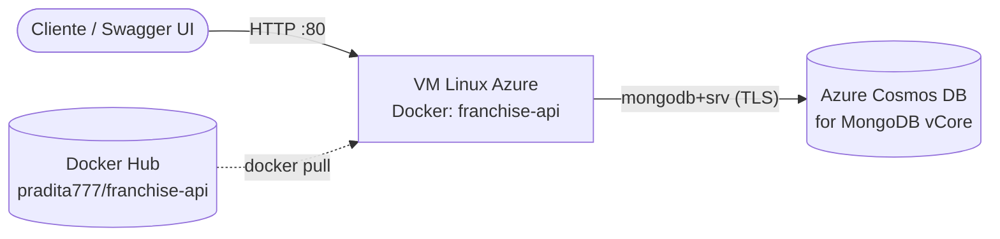

# Guía de despliegue — Franchise API

- [1. Despliegue en entorno local](#1-despliegue-en-entorno-local)
- [2. Despliegue en la nube (Azure)](#2-despliegue-en-la-nube-azure)

---

## 1. Despliegue en entorno local

### Requisitos

| Herramienta | Versión | Notas |
|---|---|---|
| JDK | 21+ | Solo para la opción A |
| Docker Desktop | Reciente | Solo para las opciones B y C |
| MongoDB | Local o Azure Cosmos DB for MongoDB (vCore) | Cadena de conexión requerida |

> No se requiere instalar Maven: el proyecto incluye Maven Wrapper (`mvnw` / `mvnw.cmd`).

### Configuración de la conexión

La aplicación lee la cadena de conexión desde la variable `mongodburi` (archivo `.env` en la raíz del proyecto o variable de entorno). Crear `franchise-api/.env`:

```properties
mongodburi=mongodb+srv://<user>:<password>@<cluster>.mongocluster.cosmos.azure.com/?tls=true&authMechanism=SCRAM-SHA-256&retrywrites=false&maxIdleTimeMS=120000
```

Para MongoDB local basta con:

```properties
mongodburi=mongodb://localhost:27017
```

> El `.env` está en `.gitignore` y `.dockerignore`: nunca se versiona ni queda dentro de la imagen.

### Opción A — Ejecutar con Maven

```powershell
cd franchise-api
.\mvnw.cmd spring-boot:run      # Windows
./mvnw spring-boot:run          # Linux / macOS
```

API en `http://localhost:8080` — Swagger en `http://localhost:8080/swagger-ui.html`.

### Opción B — Construir y ejecutar con Docker

```powershell
cd franchise-api
docker build -t pradita777/franchise-api:1.0 .
docker run -d --name franchise-api -p 8080:8080 -e mongodburi="<cadena-de-conexion>" pradita777/franchise-api:1.0
```

### Opción C — Usar la imagen publicada en Docker Hub

Sin clonar el repositorio ni compilar:

```powershell
docker run -d --name franchise-api -p 8080:8080 -e mongodburi="<cadena-de-conexion>" pradita777/franchise-api:1.0
```

Imagen: <https://hub.docker.com/r/pradita777/franchise-api>

### Verificación

```powershell
curl http://localhost:8080/api/v1/franchises        # → 200 OK (lista JSON)
```

o abrir `http://localhost:8080/swagger-ui.html`.

### Ejecutar las pruebas

```powershell
cd franchise-api
.\mvnw.cmd test                 # Windows
./mvnw test                     # Linux / macOS
```

---

## 2. Despliegue en la nube (Azure)

Arquitectura desplegada:



### Paso 1 — Base de datos: Azure Cosmos DB for MongoDB (vCore)

1. En el portal de Azure crear un recurso **Azure Cosmos DB for MongoDB (vCore)**.
2. Definir usuario y contraseña de administrador.
3. En **Networking**, permitir el acceso desde la IP pública de la VM (o servicios de Azure).
4. Copiar la cadena de conexión (`mongodb+srv://...`) desde **Connection strings**. La base `franchises_db` y la colección `franchises` se crean automáticamente al primer insert.

### Paso 2 — Publicar la imagen en Docker Hub

```powershell
docker build -t pradita777/franchise-api:1.0 .
docker login
docker push pradita777/franchise-api:1.0
```

> El nombre del repositorio debe ir **en minúsculas** (`pradita777`, no `Pradita777`); con mayúsculas Docker lo interpreta como un registry privado y el push falla.

### Paso 3 — Máquina virtual

1. Crear una **VM Linux (Ubuntu 22.04 LTS)** con IP pública y autenticación por SSH.
2. En el **NSG**, abrir los puertos de entrada `22` (SSH) y `80` (HTTP).
3. Conectarse e instalar Docker:

```bash
ssh azureuser@20.80.100.76
sudo apt-get update && sudo apt-get install -y docker.io
sudo systemctl enable --now docker
```

### Paso 4 — Ejecutar el contenedor

```bash
sudo docker run -d --name franchise-api --restart unless-stopped \
  -p 80:8080 \
  -e mongodburi="<cadena-de-conexion-cosmos>" \
  pradita777/franchise-api:1.0
```

La cadena de conexión se inyecta como variable de entorno en tiempo de ejecución: no está en el código, en el repositorio ni en la imagen.

### Paso 5 — Verificación

| Recurso | URL |
|---|---|
| Swagger UI | <http://20.80.100.76/swagger-ui/index.html> |
| API | `http://20.80.100.76/api/v1/franchises` |

```bash
sudo docker ps                          # contenedor Up
sudo docker logs -f franchise-api      # logs de arranque
```

### Actualizar la versión desplegada

```bash
sudo docker pull pradita777/franchise-api:1.0
sudo docker stop franchise-api && sudo docker rm franchise-api
# volver a ejecutar el docker run del paso 4
```
