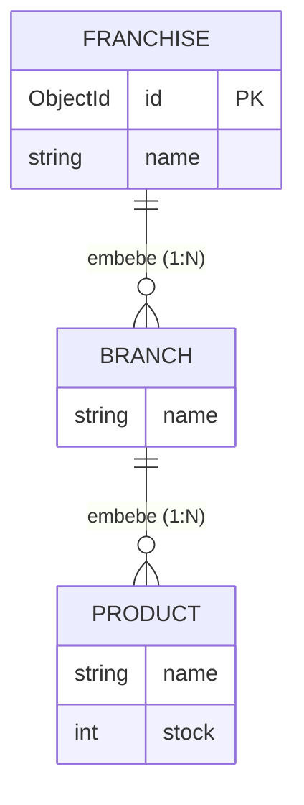

# Franchise API

API REST reactiva para la gestión de franquicias, sus sucursales y los productos ofertados en cada sucursal.

Desarrollada como prueba técnica de Desarrollador Back-end.

## Stack tecnológico

| Tecnología | Uso |
|---|---|
| Java 21 | Lenguaje |
| Spring Boot 4.1.0 (WebFlux) | Framework reactivo |
| Spring Data Reactive MongoDB | Persistencia reactiva |
| Azure Cosmos DB for MongoDB (vCore) | Base de datos en la nube |
| Maven | Gestión de dependencias |
| Lombok | Reducción de boilerplate |

## Modelo de datos

Se eligió **MongoDB** por la naturaleza jerárquica del dominio: una franquicia *contiene* sucursales y cada sucursal *contiene* sus propios productos con stock independiente. Esta relación de composición se modela de forma natural con **documentos embebidos**, permitiendo recuperar el árbol completo en una sola consulta sin joins.



Ejemplo de documento en la colección `franchises`:

```json
{
  "_id": "68b0c3...",
  "name": "Franquicia Central",
  "branches": [
    {
      "name": "Sucursal Norte",
      "products": [
        { "name": "Producto A", "stock": 25 },
        { "name": "Producto B", "stock": 10 }
      ]
    }
  ]
}
```

## Endpoints

| Método | Ruta | Descripción |
|---|---|---|
| POST | `/api/v1/franchises` | Crear una franquicia |
| POST | `/api/v1/franchises/{franchiseId}/branches` | Agregar sucursal a una franquicia |
| POST | `/api/v1/franchises/{franchiseId}/branches/{branchName}/products` | Agregar producto a una sucursal |
| DELETE | `/api/v1/franchises/{franchiseId}/branches/{branchName}/products/{productName}` | Eliminar producto de una sucursal |
| PATCH | `/api/v1/franchises/{franchiseId}/branches/{branchName}/products/{productName}/stock` | Modificar stock de un producto |
| GET | `/api/v1/franchises/{franchiseId}/top-stock-products` | Producto con más stock por sucursal |
| PATCH | `/api/v1/franchises/{franchiseId}/name` | Actualizar nombre de la franquicia (plus) |
| PATCH | `/api/v1/franchises/{franchiseId}/branches/{branchName}/name` | Actualizar nombre de la sucursal (plus) |
| PATCH | `/api/v1/franchises/{franchiseId}/branches/{branchName}/products/{productName}/name` | Actualizar nombre del producto (plus) |

> La documentación interactiva (Swagger UI) estará disponible en `/swagger-ui.html` al ejecutar la aplicación.

## Ejecución en entorno local

### Requisitos previos

- JDK 21+
- Una instancia de MongoDB (local o Azure Cosmos DB for MongoDB)

No se requiere instalar Maven: el proyecto incluye Maven Wrapper (`mvnw`).

### Configuración

La cadena de conexión se inyecta por variable de entorno para no exponer credenciales:

```powershell
# Windows (PowerShell)
$env:MONGODB_URI = "mongodb://<user>:<password>@<host>:<port>/franchises_db?tls=true&authMechanism=SCRAM-SHA-256&retrywrites=false"
```

```bash
# Linux / macOS
export MONGODB_URI="mongodb://<user>:<password>@<host>:<port>/franchises_db?tls=true&authMechanism=SCRAM-SHA-256&retrywrites=false"
```

### Arranque

```powershell
cd franchise-api
.\mvnw.cmd spring-boot:run    # Windows
./mvnw spring-boot:run        # Linux / macOS
```

La API queda disponible en `http://localhost:8080`.

## Convenciones de código

- Código 100% en inglés: clases, atributos, métodos y paquetes.
- Nombrado **camelCase** para atributos y métodos, **PascalCase** para clases, **lowercase** para paquetes.
- Clean Architecture en capas con dependencias hacia adentro: `controller` → `service` → `repository` → `entity`.

```
src/main/java/com/accenture/franchiseapi/
├── entity/         # Entidades del dominio (Franchise, Branch, Product)
├── repository/     # Interfaces de acceso a datos (Spring Data Reactive)
├── service/        # Lógica de negocio (interfaces + implementaciones)
├── controller/     # Adaptadores REST (endpoints)
├── dto/            # Objetos de transferencia (requests/responses)
├── mapper/         # Conversión entity ↔ dto
├── exception/      # Excepciones de negocio y manejo global de errores
└── config/         # Configuración (Mongo, OpenAPI, etc.)
```
- Principios Clean Code: nombres descriptivos, funciones pequeñas con única responsabilidad, sin código muerto ni dependencias sin uso.
- Programación reactiva de extremo a extremo con Project Reactor (`Mono` / `Flux`).

## Roadmap

- [x] Inicialización del proyecto y conexión a Azure Cosmos DB
- [ ] Modelo de dominio y capa de persistencia
- [ ] Endpoints CRUD (criterios 2-6)
- [ ] Endpoint de producto con mayor stock por sucursal (criterio 7)
- [ ] Endpoints plus de actualización de nombres
- [ ] Documentación con Swagger / OpenAPI
- [ ] Empaquetado con Docker (plus)
- [ ] Despliegue completo en Azure (plus)

## Autor

Andrés Prada
